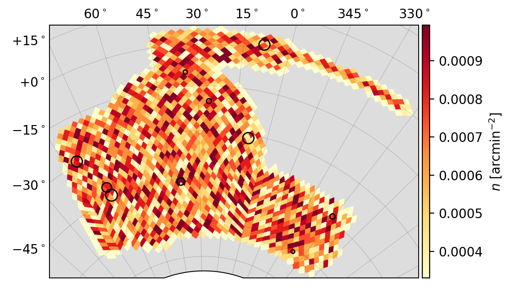
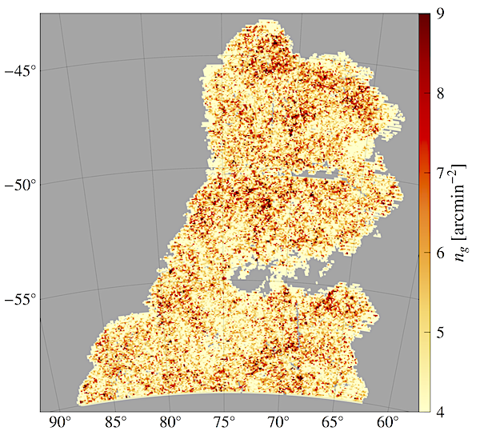
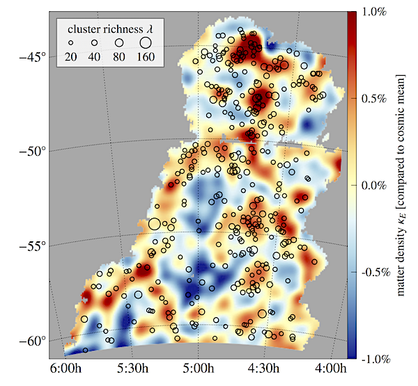

# Skymapper

A collection of python / matplotlib scripts to map astronomical survey data from the celestial sphere onto 2D. The purpose of these methods is to facilitate the creation of publication-quality plots (as well as interactive graphics or movies) with a python-based workflow many astronomers are accustomed to.

What can it do? For instance, [creating a density map](examples/example1.py) from a catalog in a few lines:

```python
import skymapper as skm

# plot density in healpix cells
nside = 64
sep = 15
fig, ax, proj = skm.plotDensity(ra, dec, nside=nside, sep=sep)

# ... same with a Healpix map m
fig, ax, proj = skm.plotHealpix(m, nside, sep=sep, cb_label='Healpix cell value')

# ... or an unordered list of ra,dec,val (only works for equal-area projections)
fig, ax, proj = skm.plotMap(ra, dec, val, sep=sep, cb_label='Map value')

# add DES footprint
skm.addFootprint('DES', proj, ax, zorder=10, edgecolor='#2222B2', facecolor='None', lw=2)
```



## Background

The code requires matplotlib and numpy (and likely healpy), but is independent of Basemap, which is not part of the matplotlib distributions anymore and can be *very* troublesome to install.

Currently, three map projections are available: the **Albers Equal-Area**, the **Lambert Conformal**, and the **Equidistant** conics (an explanation why exactly these ones, and which of them is better when, is [here](http://pmelchior.net/blog/map-projections-for-surveys.html)). Once set up, they can be used to map any point data or (HealPix) polygons onto regular matplotlib axes. The essential parts of the workflow are

1. Creating the projection, e.g. with `AlbersEqualAreaProjection(ra0,dec0,dec1,dec2)`
2. Setting up an  `matplotlib.axes` to hold the data
3. Add data to the map

The parameters of conic projections are the reference point `(ra0,dec0)` that maps onto the center `(0,0)` in the map, and two additional declinations that refer to the standard parallels of the conic projection (i.e. where a cone located above one of the poles intersects with the sphere). The parallels should be chosen to cover the range of declinations in the data set.

Steps 1 and 2 can be combined with a convenience function:

```python
aea = skm.createConicMap(ax, ra, dec, proj_type=AlbersEqualAreaProjection)
```

This method takes a predefined `axes` and lists of right ascension and declination, determines the optimal setting for the conic projections, and sets the axes ranges to hold all of `ra, dec`.

More projections and plot types will be added as needed. Open an issue for any such request.

##Limitation(s)

The projection is not a full-fledged [matplotlib transformation](http://matplotlib.org/users/transforms_tutorial.html). It does allow you to zoom and drag interactively, but the tick labels and the mouse position do not update correctly. The underlying reason is that the map pretends (x,y) to be independent variables, which isn't true for a non-linear transformation.

While perfectly sufficient for publication-quality plots, it's not ideal for exploratory work. An experimental attempt to implement a native matplotlib transform class is [here](aea_projection.py).

## Detailed examples

The examples are based on the [first data release](http://des.ncsa.illinois.edu/releases/sva1) of the [Dark Energy Survey](http://www.darkenergysurvey.org), but any other data set with RA/Dec coordinates will do. You can see how to set up the map and how to style all elements of the visualization.

### Density / depth map

This example explains what happens inside of `plotHealpix()`, in case you want to modify specific aspects.

We use healpy to pixelate the sky, and count how many objects from a given catalog fall in each pixel. The relevant function call is `getCountAtLocations`, which returns a list of counts (in units of 1/arcmin^2), cell RA and Dec, and (optionally) the vertices of a polygon that confines the cell, for each cell with non-zero count.

We transform those vertices and put them as polygons onto the map. We finish up with a decent looking colorbar.

```python
# load projection and helper functions
import numpy as np
import skymapper as skm
import matplotlib.pylab as plt

# load RA/Dec from catalog [not implemented]
ra, dec = getCoords(catalogfile)

# get count in healpix cells (as vertices), restrict to non-empty cells
nside = 1024
bc, ra, dec, vertices = skm.getCountAtLocations(ra, dec, nside=nside, return_vertices=True)

# setup figure
import matplotlib.cm as cm
cmap = cm.YlOrRd
fig = plt.figure(figsize=(6.5,6))
ax = fig.add_subplot(111, aspect='equal')

# setup map: define AEA map optimal for given RA/Dec
proj = skm.createConicMap(ax, ra, dec, proj_class=skm.AlbersEqualAreaProjection)
# add lines and labels for meridians/parallels (separation 5 deg)
sep = 5
meridians = np.arange(-90, 90+sep, sep)
parallels = np.arange(0, 360+sep, sep)
skm.setMeridianPatches(ax, proj, meridians, linestyle='-', lw=0.5, alpha=0.3, zorder=2)
skm.setParallelPatches(ax, proj, parallels, linestyle='-', lw=0.5, alpha=0.3, zorder=2)
skm.setMeridianLabels(ax, proj, meridians, loc="left", fmt=skm.pmDegFormatter)
skm.setParallelLabels(ax, proj, parallels, loc="bottom")

# add vertices as polygons
vmin, vmax = np.percentiles(bc,[10,90])
poly = skm.addPolygons(vertices, proj, ax, color=bc, vmin=vmin, vmax=vmax, cmap=cmap, zorder=3, rasterized=True)

# add colorbar
from mpl_toolkits.axes_grid1 import make_axes_locatable
divider = make_axes_locatable(ax)
cax = divider.append_axes("right", size="2%", pad=0.0)
cb = fig.colorbar(poly, cax=cax)
cb.set_label('$n_g$ [arcmin$^{-2}$]')
cb.solids.set_edgecolor("face")

# show (and save) ...
fig.tight_layout()
fig.show()
fig.savefig(imagefile)
```

The result (with DES SV data) looks like this (taken from [Crocce et al. (2016)](http://adsabs.harvard.edu/abs/2016MNRAS.455.4301C)):



### Scalar function map with scatter plot

This example explains what happens inside of `plotMap()`, in case you want to modify specific aspects.

If the data is in the form of a scalar function, defined on a regular grid in RA/Dec, there are two options to plot it.

1. Construct vertices of each of the input cells and transform them as in the example above
2. Exploit the equal-area property of Albers projection and simply plot one polygon per cell centered on the mean cell position in the map.

The 2nd version is not exact and thus requires a bit of care to make sure that the markers have the right size (`getMarkerSizeToFill` will do that), but it'll demonstrate the scatter plot functionality. For good measure, we'll combine two of them:

```python
# load projection and helper functions
import numpy as np
import skymapper as skm
import matplotlib.pylab as plt

# setup figure
import matplotlib.cm as cm
cmap = cm.RdYlBu_r
fig = plt.figure(figsize=(6.5,6))
ax = fig.add_subplot(111, aspect='equal')

# load scalar function
# here lensing convergence kappa [not implemented]
ra, dec, kappa = getKappa()

# setup map: define AEA map optimal for given RA/Dec
proj = skm.createConicMap(ax, ra, dec, proj_class=skm.AlbersEqualAreaProjection)
# add lines and labels for meridians/parallels (separation 5 deg)
meridians = np.linspace(-60, -45, 4)
parallels = np.linspace(60, 90, 7)
skm.setMeridianPatches(ax, proj, meridians, linestyle=':', lw=0.5, zorder=2)
skm.setParallelPatches(ax, proj, parallels, linestyle=':', lw=0.5, zorder=2)
skm.setMeridianLabels(ax, proj, meridians, loc="left", fmt=skm.pmDegFormatter)
skm.setParallelLabels(ax, proj, parallels, loc="bottom", fmt=skm.hourAngleFormatter)

# convert to map coordinates and plot a marker for each point
x,y = proj(ra, dec)
marker = 's'
markersize = skm.getMarkerSizeToFill(fig, ax, x, y)
vmin,vmax = -0.01, 0.01
sc = ax.scatter(x,y, c=kappa, edgecolors='None', marker=marker, s=markersize, cmap=cmap, vmin=vmin, vmax=vmax, rasterized=True, zorder=1)

# overplot with another data set
# here clusters [not implemented]
ra, dec, richness = getClusters()
x,y  = proj(ra, dec)
scc = ax.scatter(x,y, c='None', edgecolors='k', linewidths=1, s=richness, marker='o', zorder=3)

# add colorbar
from mpl_toolkits.axes_grid1 import make_axes_locatable
divider = make_axes_locatable(ax)
cax = divider.append_axes("right", size="3%", pad=0.0)
cb = fig.colorbar(sc, cax=cax)
cb.set_label('matter density $\kappa_E$ [compared to cosmic mean]')
ticks = np.linspace(vmin, vmax, 5)
cb.set_ticks(ticks)
cb.set_ticklabels([('%.1f' % (100*t)) + '\%'  for t in ticks])
cb.solids.set_edgecolor("face")

# show (and save) ...
fig.tight_layout()
fig.show()
fig.savefig(imagefile)
```

The result will look similar to this (an alternate version of a figure in [Chang et al. (2015)](http://adsabs.harvard.edu/abs/2015PhRvL.115e1301C)):


